# labs
## Лабораторная работа 1

### Задание 1 — Привет и возраст
```python
name = input("Имя: ")
age = int(input("Возраст: "))
print(f"Привет, {name}! Через год тебе будет {age+1}.")
```
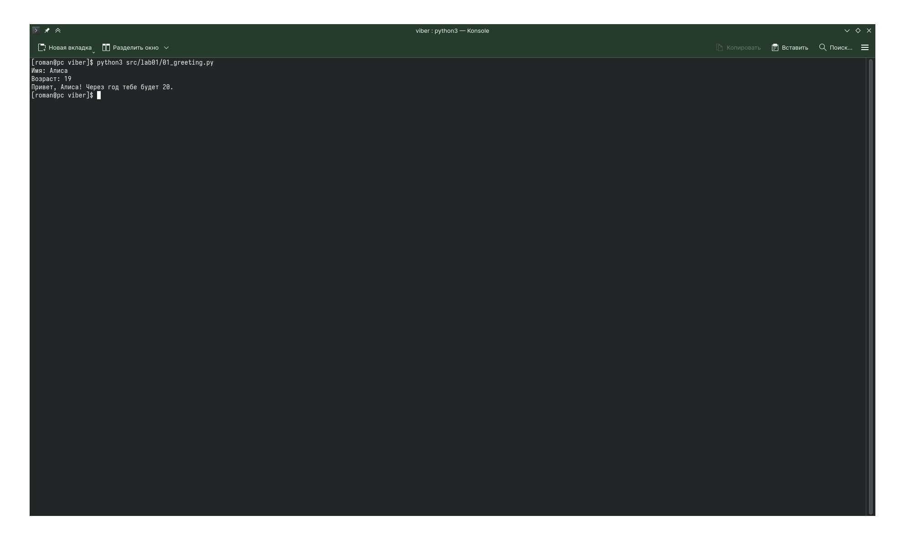

### Задание 2 — Сумма и среднее
```python
a = float(input("a: ").replace(",", "."))
b = float(input("b: ").replace(",", "."))
print(f"sum={a+b:.2f}; avg={(a+b)/2:.2f}")
```


### Задание 3 — Чек: скидка и НДС
```python
price = float(input("Цена: ").replace(",", "."))
discount = float(input("Скидка: ").replace(",", "."))
vat = float(input("НДС: ").replace(",", "."))
base = price * (1 - discount / 100)
vat_amount = base * (vat / 100)
total = base + vat_amount
print(f"База после скидки: {base:.2f} ₽")
print(f"НДС:               {vat_amount:.2f} ₽")
print(f"Итого к оплате:    {total:.2f} ₽")
```
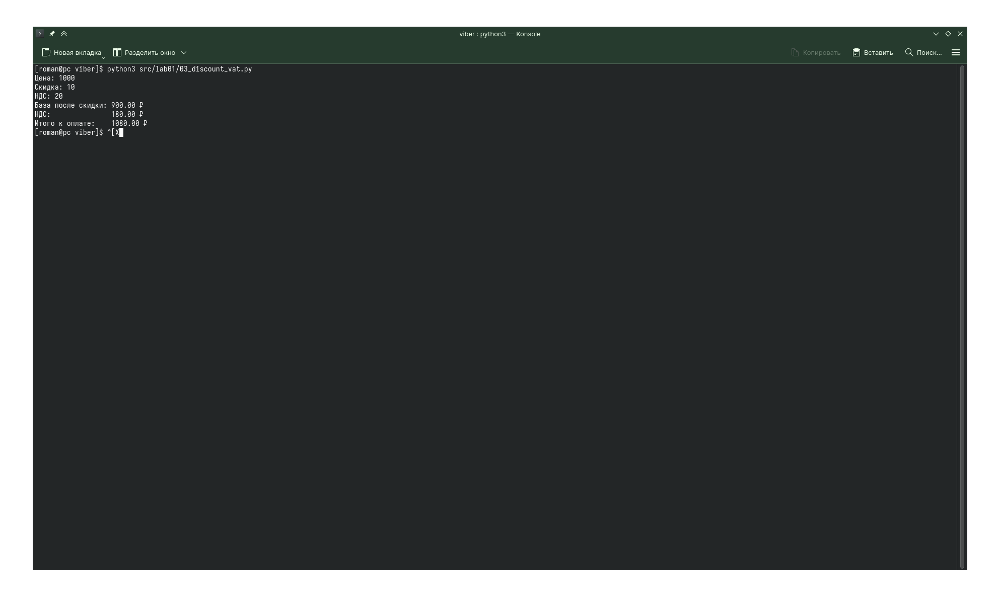

### Задание 4 — Минуты → ЧЧ:ММ
```python
m = int(input("Минуты: "))
print(f"{m//60}:{m%60:02d}")
```


### Задание 5 — Инициалы и длина строки
```python
fio = input("ФИО: ")
f, i, o = fio.split()
FIO = f[0].upper() + i[0].upper() + o[0].upper()
print(f"Инициалы: {FIO}.")
fio_len = sum(map(len, (f, i, o))) + 2
print(f"Длина (символов): {fio_len}")
```
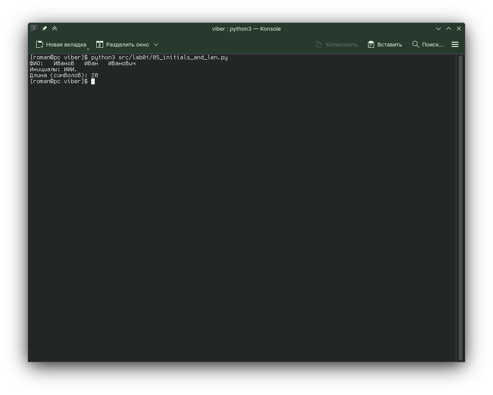

### Задание 6 — Счёт участников
```python
rows = int(input("in_1: "))
c_ochno = 0
c_zaochno = 0
for i in range(rows):
    f, i, age, ochno = input(f"in_{i+2}: ").split()
    if ochno == "True":
        c_ochno += 1
    else:
        c_zaochno += 1
print(f"out: {c_ochno} {c_zaochno}")
```


### Задание 7 — Декодирование
```python
text = input("in: ")
start = [i.isupper() for i in text].index(True)
second = [i.isdecimal() for i in text].index(True, start) + 1
print(text[start :: second - start])
```
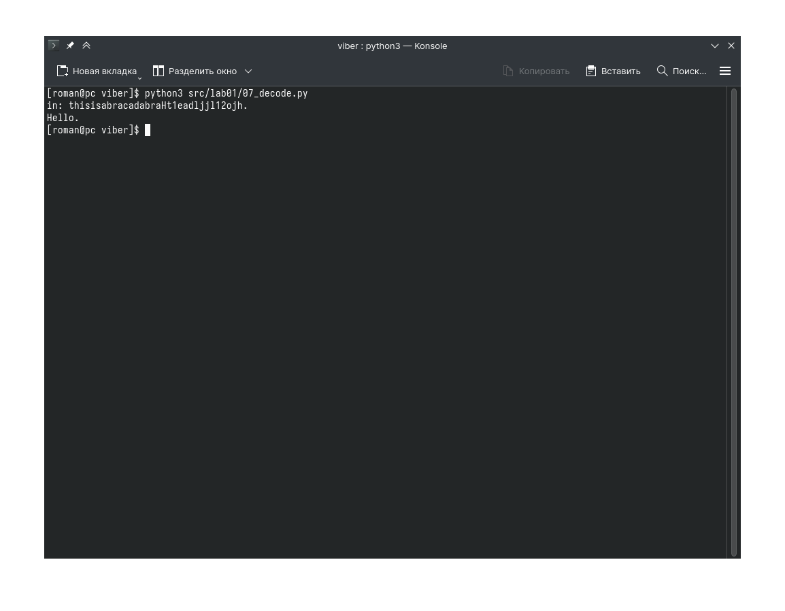

## Лабораторная работа 2

### Задание 1 — `arrays.py`
```python
from ..lib.test import run


def min_max(nums: list[float | int]) -> tuple[float | int, float | int]:
    """
    Возвращает кортеж с минимумом и максимумом значений списка
    """
    if not len(nums):
        raise ValueError("List is empty")
    return min(nums), max(nums)


def unique_sorted(nums: list[float | int]) -> list[float | int]:
    """
    Возвращает отсортированный список без дубликатов
    """
    return sorted(set(nums))


def flatten(mat: list[list | tuple]) -> list:
    """
    Возвращает список, в котором значения из списков в списке
    """
    r = []
    for i in mat:
        if not (isinstance(i, list) or isinstance(i, tuple)):
            raise TypeError("List entry is not a list or tuple")
        r.extend(i)
    return r


if __name__ == "__main__":
    run(lambda: min_max([3, -1, 5, 5, 0]), result=(-1, 5))
    run(lambda: min_max([42]), result=(42, 42))
    run(lambda: min_max([-5, -2, -9]), result=(-9, -2))
    run(lambda: min_max([]), result=ValueError)
    run(lambda: min_max([1.5, 2, 2.0, -3.1]), result=(-3.1, 2))

    run(lambda: unique_sorted([3, 1, 2, 1, 3]), result=[1, 2, 3])
    run(lambda: unique_sorted([]), result=[])
    run(lambda: unique_sorted([-1, -1, 0, 2, 2]), result=[-1, 0, 2])
    run(lambda: unique_sorted([1.0, 1, 2.5, 2.5, 0]), result=[0, 1.0, 2.5])

    run(lambda: flatten([[1, 2], [3, 4]]), result=[1, 2, 3, 4])
    run(lambda: flatten(([1, 2], (3, 4, 5))), result=[1, 2, 3, 4, 5])
    run(lambda: flatten([[1], [], [2, 3]]), result=[1, 2, 3])
    run(lambda: flatten([[1, 2], "ab"]), result=TypeError)
```
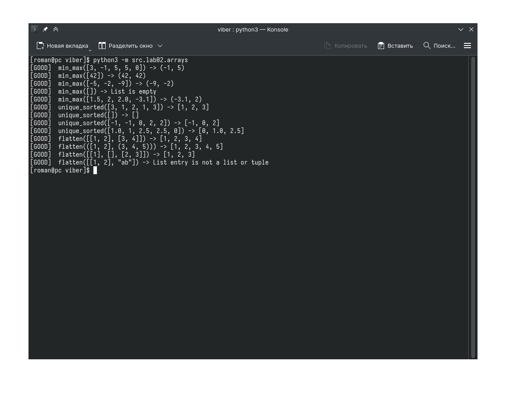

### Задание 2 — `matrix.py`
```python
from ..lib.rectmtrx import chkrectmtrx
from ..lib.test import run


def transpose(mat: list[list[float | int]]) -> list[list]:
    """
    Меняет строки и столбцы в mat местами и возвращает результат (mat не изменяется)

    """
    chkrectmtrx(mat)
    return [[*i] for i in zip(*mat)]


def row_sums(mat: list[list[float | int]]) -> list[float]:
    """
    Возвращает список с суммами строк mat
    """
    chkrectmtrx(mat)
    return [sum(l) for l in mat]


def col_sums(mat: list[list[float | int]]) -> list[float]:
    """
    Возвращает список с суммами столбцов mat
    """
    return row_sums(transpose(mat))


if __name__ == "__main__":
    run(lambda: transpose([[1, 2, 3]]), result=[[1], [2], [3]])
    run(lambda: transpose([[1], [2], [3]]), result=[[1, 2, 3]])
    run(lambda: transpose([[1, 2], [3, 4]]), result=[[1, 3], [2, 4]])
    run(lambda: transpose([]), result=[])
    run(lambda: transpose([[1, 2], [3]]), result=ValueError)

    run(lambda: row_sums([[1, 2, 3], [4, 5, 6]]), result=[6, 15])
    run(lambda: row_sums([[-1, 1], [10, -10]]), result=[0, 0])
    run(lambda: row_sums([[0, 0], [0, 0]]), result=[0, 0])
    run(lambda: row_sums([[1, 2], [3]]), result=ValueError)

    run(lambda: col_sums([[1, 2, 3], [4, 5, 6]]), result=[5, 7, 9])
    run(lambda: col_sums([[-1, 1], [10, -10]]), result=[9, -9])
    run(lambda: col_sums([[0, 0], [0, 0]]), result=[0, 0])
    run(lambda: col_sums([[1, 2], [3]]), result=ValueError)
```
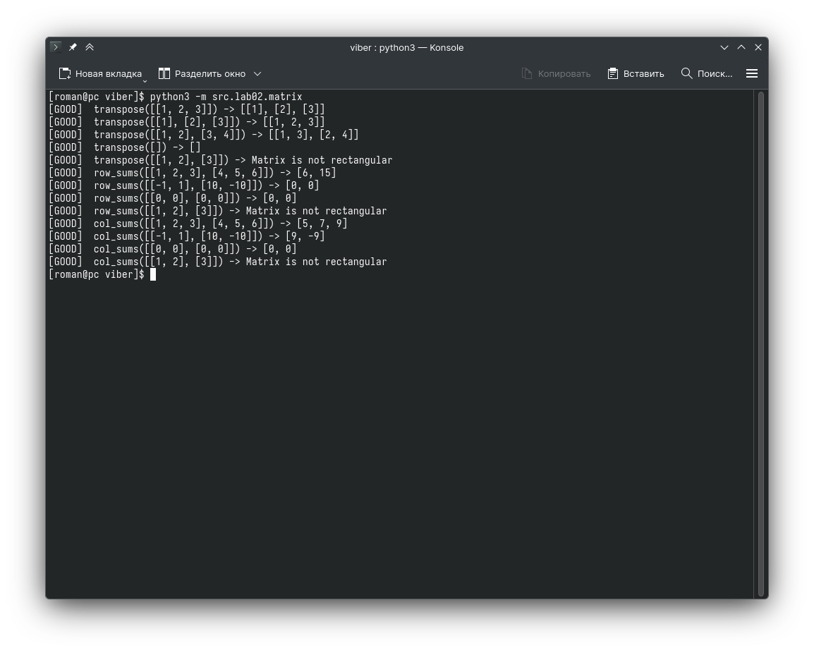

### Задание 3 — `tuples.py`
```python
from ..lib.test import run


def format_record(rec: tuple[str, str, float]) -> str:
    """
    Возвращает строку из записи (fio: str, group: str, gpa: float).
    Пример: Иванов И.И., гр. BIVT-25, GPA 4.60
    """
    initials = rec[0].split()
    if len(initials) not in (2, 3):
        raise ValueError("Unsupported initials length")
    fmti = f"{initials[0].title()} {initials[1][0].upper()}."
    if len(initials) == 3:
        fmti += f"{initials[2][0].upper()}."
    return f"{fmti}, гр. {rec[1].strip()}, GPA {rec[2]:.2f}"


if __name__ == "__main__":
    run(
        lambda: format_record(("Иванов Иван Иванович", "BIVT-25", 4.6)),
        result="Иванов И.И., гр. BIVT-25, GPA 4.60",
    )
    run(
        lambda: format_record(("Петров Пётр", "IKBO-12", 5.0)),
        result="Петров П., гр. IKBO-12, GPA 5.00",
    )
    run(
        lambda: format_record(("Петров Пётр Петрович", "IKBO-12", 5.0)),
        result="Петров П.П., гр. IKBO-12, GPA 5.00",
    )
    run(
        lambda: format_record(("  сидорова  анна   сергеевна ", "ABB-01", 3.999)),
        result="Сидорова А.С., гр. ABB-01, GPA 4.00",
    )
```
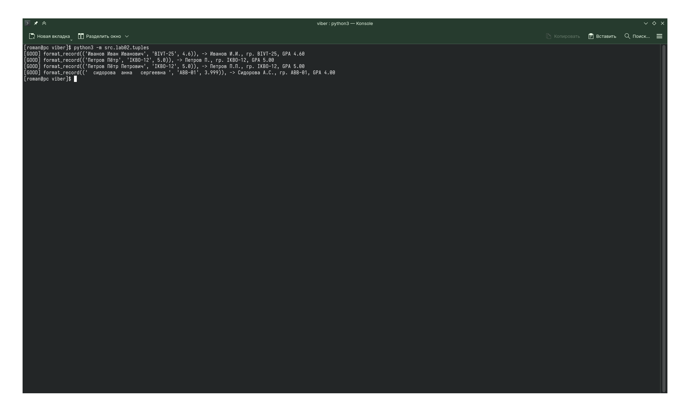

## Лабораторная работа 3

### Модуль text.py
#### src/lib/text.py
```python
import re
import collections


def normalize(text: str, *, casefold: bool = True, yo2e: bool = True) -> str:
    """
    Нормализует строку. По умолачнию приводит к нижнему регистру (casefold) и
    заменяет Ё на Е и е на ё (yo2e)
    """
    if casefold:
        text = text.casefold()
    if yo2e:
        text = text.replace("ё", "е").replace("Ё", "е")
    return " ".join(text.split())


def tokenize(text: str) -> list[str]:
    """
    Разделяет текст на слова, удаляя лишние символы (эмодзи)
    """
    return re.findall(r"\w+(?:-\w+)*", text)


def count_freq(tokens: list[str]) -> dict[str, int]:
    """
    Считает частоту слов
    """
    return dict(collections.Counter(tokens).items())


def top_n(freq: dict[str, int], n: int = 5) -> list[tuple[str, int]]:
    """
    Считает топ-N по убыванию частоты и алфавиту слова.
    """
    return sorted(map(tuple, freq.items()), key=lambda o: (-o[1], o[0]))[:n]
```
#### Тесты: src/lab03/test_text.py
```python
from ..lib.test import run
from ..lib import text

if __name__ == "__main__":
    run(lambda: text.normalize("ПрИвЕт\nМИр\t"), result="привет мир")
    run(lambda: text.normalize("ёжик, Ёлка"), result="ежик, елка")
    run(lambda: text.normalize("Hello\r\nWorld"), result="hello world")
    run(lambda: text.normalize("  двойные   пробелы  "), result="двойные пробелы")

    run(
        lambda: text.normalize("Ёлки\tиголки", casefold=False, yo2e=False),
        result="Ёлки иголки",
    )

    run(lambda: text.tokenize("привет мир"), result=["привет", "мир"])
    run(lambda: text.tokenize("hello,world!!!"), result=["hello", "world"])
    run(lambda: text.tokenize("по-настоящему круто"), result=["по-настоящему", "круто"])
    run(lambda: text.tokenize("2025 год"), result=["2025", "год"])

    run(lambda: text.tokenize("emoji 😀 не слово"), result=["emoji", "не", "слово"])

    r1 = {"a": 3, "b": 2, "c": 1}
    run(lambda: text.count_freq(["a", "b", "a", "c", "b", "a"]), result=r1)
    run(lambda: text.top_n(r1, n=2), result=[("a", 3), ("b", 2)])

    r2 = {"aa": 2, "bb": 2, "cc": 1}
    run(lambda: text.count_freq(["bb", "aa", "bb", "aa", "cc"]), result=r2)
    run(lambda: text.top_n(r2, n=2), result=[("aa", 2), ("bb", 2)])
```
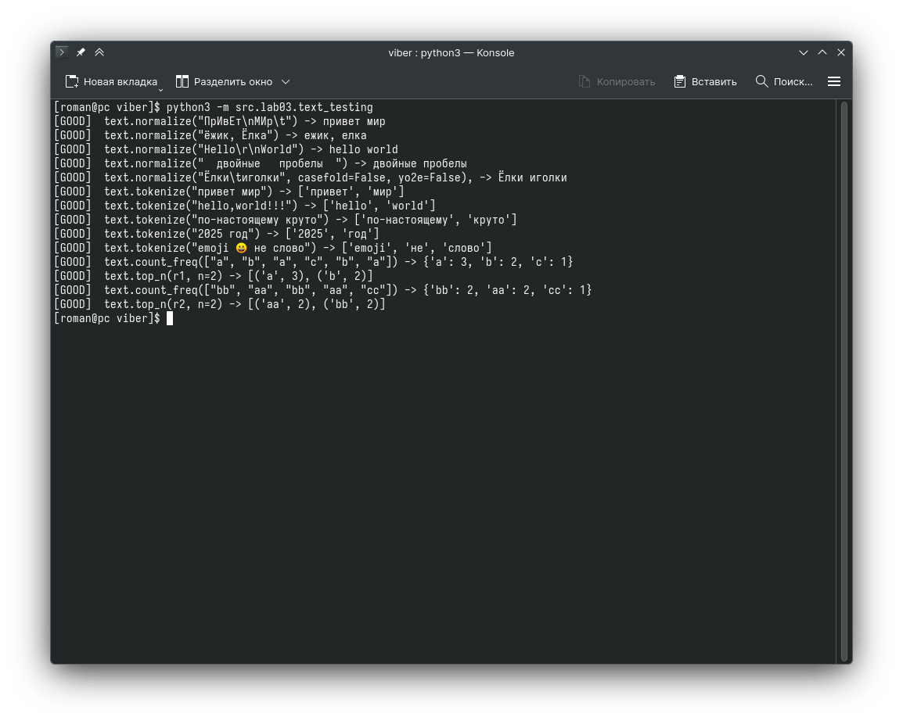

### Скрипт text_stats
```python
# Читает 1 строку
from ..lib import text
from ..lib import tblprint

if __name__ == "__main__":
    line = input()
    words = text.tokenize(text.normalize(line))
    print(f"Всего слов: {len(words)}")
    freq = text.count_freq(words)
    print(f"Уникальных слов: {len(freq)}")
    print("Топ-5:")
    top5 = text.top_n(freq, n=5)
    tblprint.print_table(["слово", "частота"], top5)
```
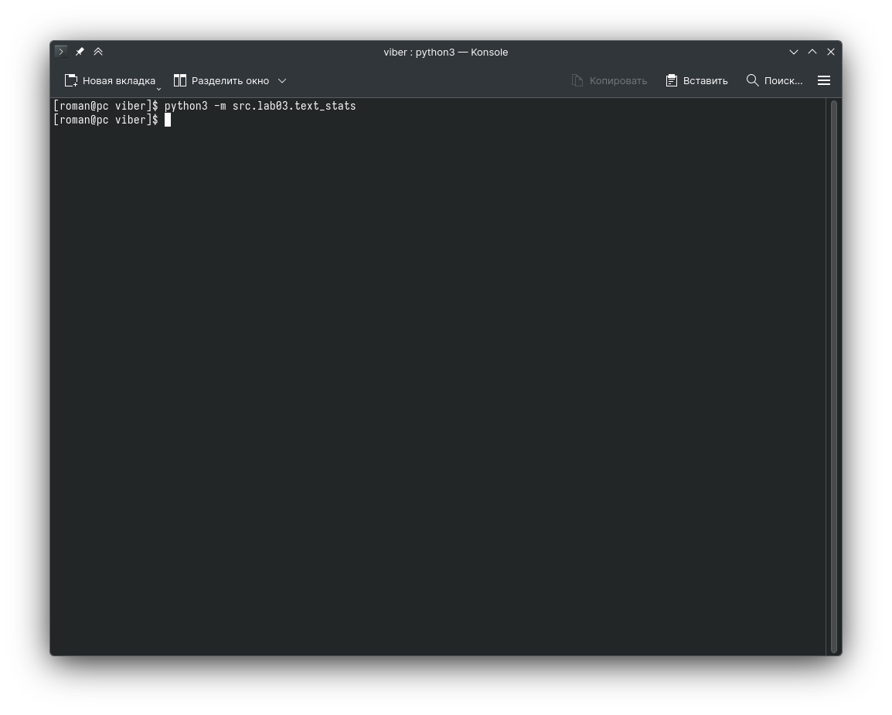

## Лабораторная работа 4

### Скрипт text_report
#### src/lib/file_lib.py
```python
import csv
from pathlib import Path
from typing import Iterable, Sequence

# import text


def read_text(path: str | Path, encoding: str = "utf-8") -> str:
    """
    Читает текст из файла по пути в указанной кодировке (например, encoding="cp1251")

    Может вызвать FileNotFoundError и UnicodeDecodeError
    """
    p = Path(path)
    return p.read_text(encoding=encoding)


def write_csv(
    rows: Iterable[Sequence], path: str | Path, header: tuple[str, ...] | None = None
) -> None:
    """
    Записывает CSV по указанному пути

    Заголовки необязательны
    """
    p = Path(path)

    with p.open("w", newline="", encoding="utf-8") as f:
        w = csv.writer(f)
        if header is not None:
            w.writerow(header)
        for r in rows:
            w.writerow(r)


def ensure_parent_dir(path: str | Path) -> None:
    """
    Создаёт родительские директории, если их ещё нет.
    """
    Path(path).parent.mkdir(parents=True, exist_ok=True)
```
#### Тесты: src/lab04/text_report.py
```python
import argparse
from ..lib import text
from ..lib import tblprint
from ..lib import file_lib


def main_multiple(
    srcs: list[str], pff: str | None, totalf: str | None, encoding: str | None = None
) -> None:
    """
    Выполняет анализ нескольких файлов.

    srcs: список путей к файлам
    pff: путь к per_file.txt
    totalf: путь к total.txt

    encoding: кодировка (по умолчанию UTF-8)
    """
    per_file = []
    total = {}
    for src in srcs:
        doc = file_lib.read_text(src, encoding=encoding or "utf-8")
        words = text.tokenize(text.normalize(doc))
        freq = text.count_freq(words)
        top = text.top_n(freq, n=len(freq))
        per_file.extend([src, *i] for i in top)
        for word, count in freq.items():
            total[word] = total.get(word, 0) + count

    if pff:
        file_lib.ensure_parent_dir(pff)
        file_lib.write_csv(per_file, pff, ["file", "word", "count"])

    if totalf:
        file_lib.ensure_parent_dir(totalf)
        top = text.top_n(total, n=len(total))
        file_lib.write_csv(top, totalf, ["word", "count"])


def main_single(src: str, tgt: str | None = None, encoding: str | None = None) -> None:
    """
    Выполняет анализ одного файла.

    src: путь к файлу
    tgt: путь к выводу (CSV)

    encoding: кодировка (по умолчанию UTF-8)
    """
    doc = file_lib.read_text(src, encoding=encoding or "utf-8")
    words = text.tokenize(text.normalize(doc))
    print(f"Всего слов: {len(words)}")
    freq = text.count_freq(words)
    print(f"Уникальных слов: {len(freq)}")
    print("Топ-5:")
    top = text.top_n(freq, n=len(freq))
    tblprint.print_table(["слово", "частота"], top[:5])
    if tgt:
        file_lib.ensure_parent_dir(tgt)
        file_lib.write_csv(top, tgt, ["word", "count"])


def main():
    parser = argparse.ArgumentParser(
        prog="Text Report", description="Считает статистику по словам"
    )
    parser.add_argument("-i", "--in", required=True, nargs="+")
    parser.add_argument("-o", "--out")
    parser.add_argument("-e", "--encoding")
    parser.add_argument("-p", "--per-file")
    parser.add_argument("-t", "--total")
    args = parser.parse_args()
    in_files = getattr(args, "in")
    if len(in_files) == 1:
        if args.per_file or args.total:
            raise ValueError("--per-file and --total require multiple files")
        main_single(in_files[0], args.out, encoding=args.encoding)
    else:
        if args.out:
            raise ValueError("--out is only for single files")
        main_multiple(in_files, args.per_file, args.total, encoding=args.encoding)


if __name__ == "__main__":
    main()
```
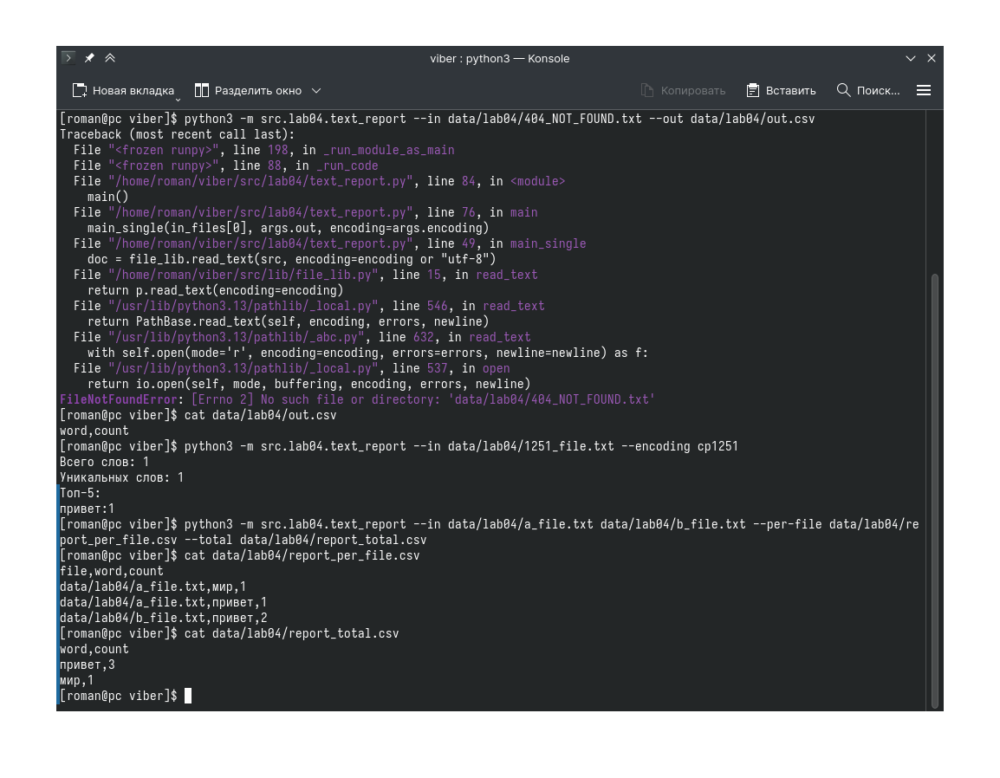

## Лабораторная работа 5

### Конвертация файлов
#### src/lib/json_csv.py
```python
import csv
import json


def json_to_csv(json_path: str, csv_path: str) -> None:
    """
    Преобразует JSON-файл в CSV.
    Поддерживает список словарей [{...}, {...}], заполняет отсутствующие поля пустыми строками.

    Кодировка UTF-8. Порядок колонок — как в первом объекте.

    json_path: Путь к JSON файлу
    csv_path: Путь к CSV файлу
    """
    with open(json_path) as f:
        jcon = json.load(f)
    headers = [i for i in jcon[0]]
    with open(csv_path, "w") as f:
        writer = csv.DictWriter(f, fieldnames=headers)
        writer.writerow({i: i for i in headers})  # lol
        for obj in jcon:
            writer.writerow(obj)


def csv_to_json(csv_path: str, json_path: str) -> None:
    """
    Преобразует CSV в JSON (список словарей).
    Заголовок обязателен, значения сохраняются как строки.

    csv_path: Путь к CSV файлу
    json_path: Путь к JSON файлу
    """
    with open(csv_path) as f:
        ccon = list(csv.DictReader(f))
    with open(json_path, "w") as f:
        json.dump(ccon, f, ensure_ascii=False, indent=2)
```
#### src/lib/csv_xlsx.py
```python
import csv
import xlsxwriter


def csv_to_xlsx(csv_path: str, xlsx_path: str) -> None:
    """
    Преобразует CSV в XLSX
    Заголовок обязателен, значения сохраняются как строки.

    csv_path: Путь к CSV файлу
    xlsx_path: Путь к XLSX файлу
    """
    with open(csv_path) as f:
        ccon = list(csv.DictReader(f))

    workbook = xlsxwriter.Workbook(xlsx_path)
    sheet = workbook.add_worksheet()
    for i, row in enumerate(ccon):
        for j, val in enumerate(row.values()):
            sheet.write(i, j, val)
    sheet.autofit()
    workbook.close()
```
#### Тесты: src/lab05/file_converter.py
```python
from ..lib import json_csv, csv_xlsx, file_lib

file_lib.ensure_parent_dir("data/out/people.csv")
json_csv.json_to_csv("data/samples/people.json", "data/out/people.csv")
json_csv.csv_to_json("data/samples/people.csv", "data/out/people.json")
csv_xlsx.csv_to_xlsx("data/samples/cities.csv", "data/out/people.xlsx")

json_csv.json_to_csv("data/samples/ports.json", "data/out/ports.csv")
json_csv.csv_to_json("data/samples/ports.csv", "data/out/ports.json")
csv_xlsx.csv_to_xlsx("data/samples/labs.csv", "data/out/labs.xlsx")
```
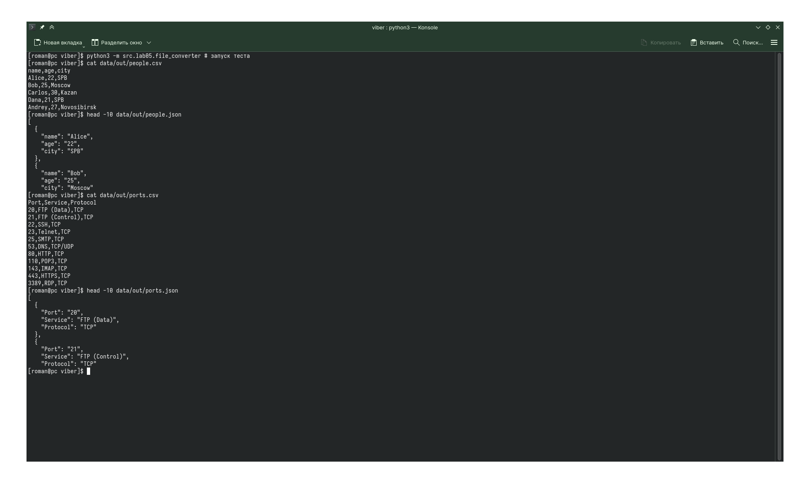
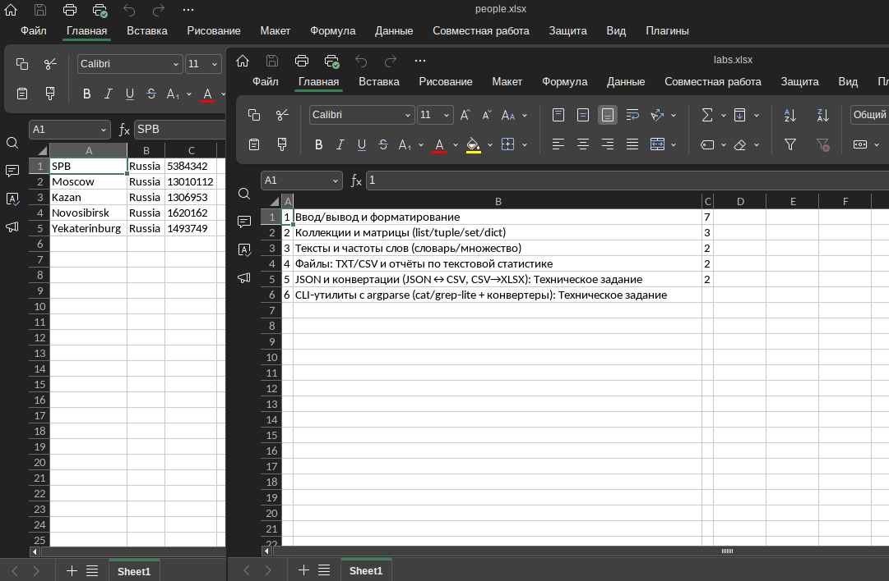

## Лабораторная работа 6

### Работа с одним файлом - cli_text
```python
import argparse


def main_cat(input_file: str, count: bool = False) -> None:
    """
    Выводит построчно указанный файл.

    input_file: Путь к файлу
    count: Выводить номера строка
    """
    with open(input_file) as f:
        for i, line in enumerate(f):
            print((f"{i+1:>4} " if count else "") + line)


def main_stats(input_file: str, top: int = 5) -> None:
    """
    Выводит статистику по файлу

    input_file: Путь к файлу
    top: Сколько слов выводить
    """
    with open(src) as f:
        doc = f.read()
    words = text.tokenize(text.normalize(doc))
    print(f"Всего слов: {len(words)}")
    freq = text.count_freq(words)
    print(f"Уникальных слов: {len(freq)}")
    print(f"Топ-{top}:")
    top = text.top_n(freq, n=len(freq))
    tblprint.print_table(["слово", "частота"], top[:top])


def main():
    parser = argparse.ArgumentParser(
        prog="", description="CLI‑утилита для работы с файлами"
    )
    subparsers = parser.add_subparsers(dest="command")

    cat_parser = subparsers.add_parser("cat", help="Вывести содержимое файла")
    cat_parser.add_argument("--input", required=True)
    cat_parser.add_argument("-n", action="store_true", help="Нумеровать строки")

    # подкоманда stats
    stats_parser = subparsers.add_parser("stats", help="Частоты слов")
    stats_parser.add_argument("--input", required=True)
    stats_parser.add_argument("--top", type=int, default=5)

    args = parser.parse_args()

    if args.command == "cat":
        main_cat(args.input, args.n)
    elif args.command == "stats":
        main_stats(args.input, args.top)


if __name__ == "__main__":
    main()
```
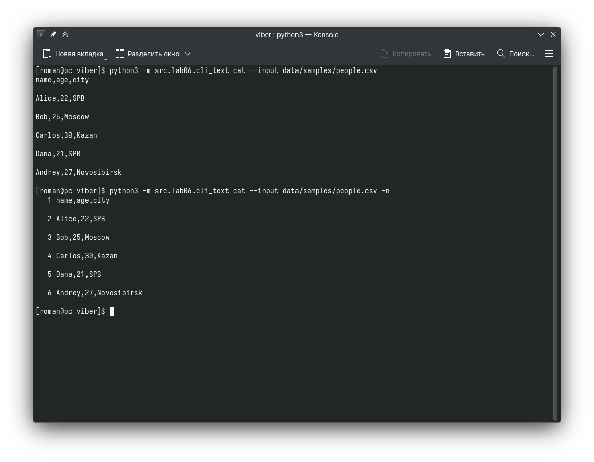

### Работа с двумя файлами - converter
```python
import argparse
from ..lib.json_csv import json_to_csv, csv_to_json
from ..lib.csv_xlsx import csv_to_xlsx


def main():
    parser = argparse.ArgumentParser(description="Конвертеры данных")
    sub = parser.add_subparsers(dest="cmd")

    p1 = sub.add_parser("json2csv")
    p1.add_argument("--in", dest="input", required=True)
    p1.add_argument("--out", dest="output", required=True)

    p2 = sub.add_parser("csv2json")
    p2.add_argument("--in", dest="input", required=True)
    p2.add_argument("--out", dest="output", required=True)

    p3 = sub.add_parser("csv2xlsx")
    p3.add_argument("--in", dest="input", required=True)
    p3.add_argument("--out", dest="output", required=True)

    args = parser.parse_args()

    func = {"json2csv": json_to_csv, "csv2json": csv_to_json, "csv2xlsx": csv_to_xlsx}[
        args.cmd
    ]
    func(args.input, args.output)


if __name__ == "__main__":
    main()
```
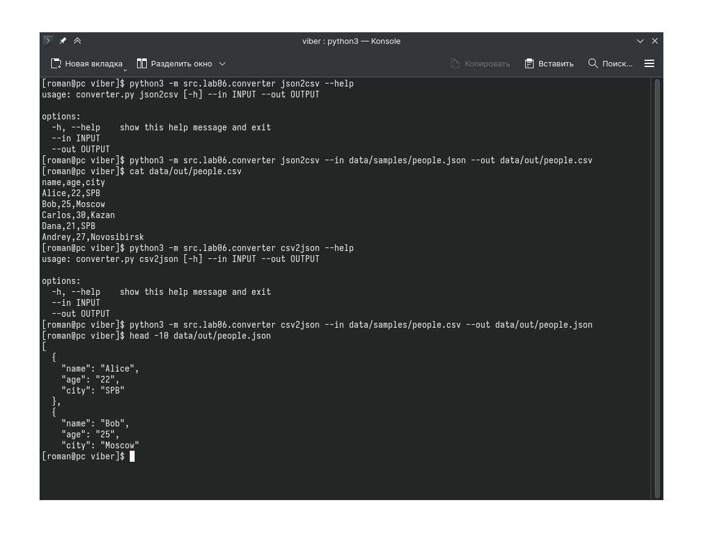
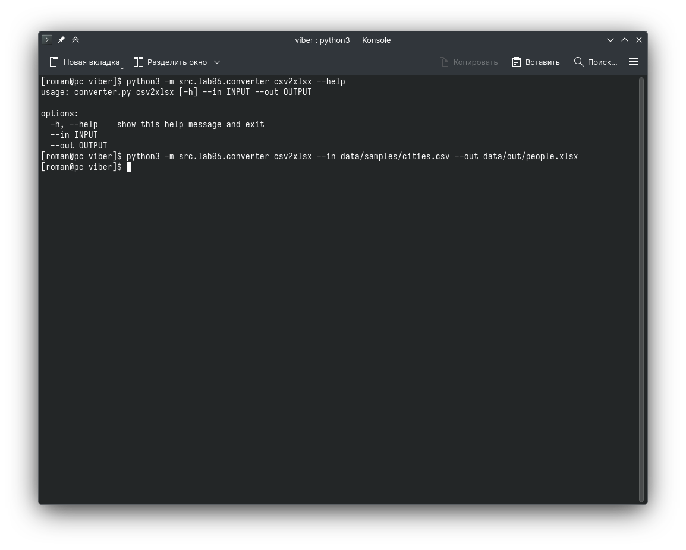

## [Лабораторная работа 7](src/lab07/README.md)

## [Лабораторная работа 8](src/lab08/README.md)

