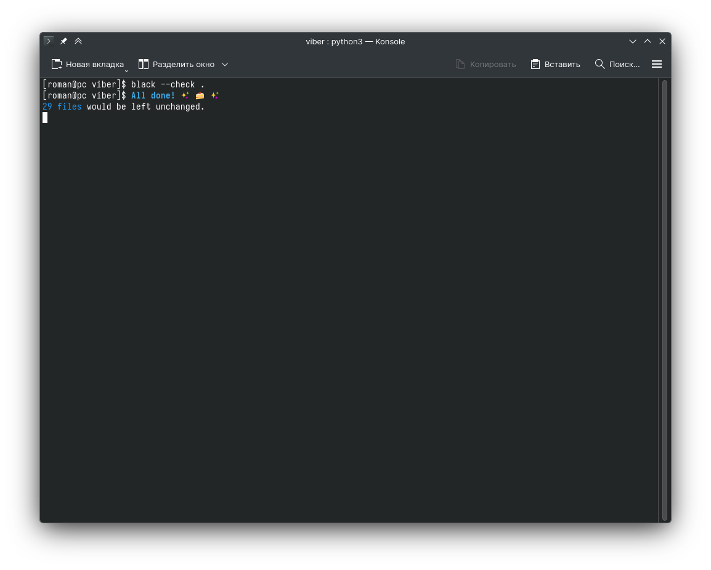
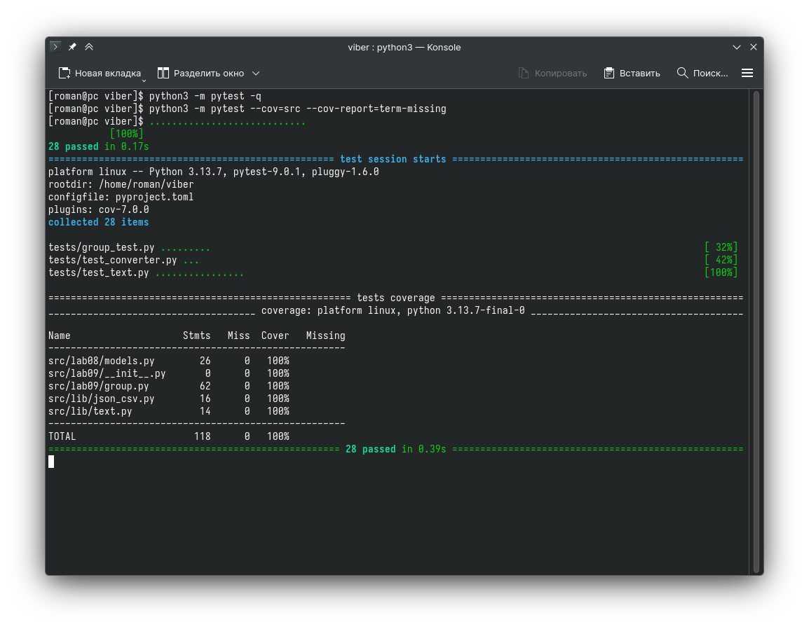

# Лабораторная работа 7

## Форматирование


## Тесты
### tests/test_converter.py
```python
from src.lib import json_csv  # csv_xlsx, file_lib

from pathlib import Path
import json, csv  # у препода python 4 с autoimport не переживайте

import pytest


def test_json_to_csv_roundtrip(tmp_path: Path):
    src = tmp_path / "people.json"
    dst = tmp_path / "people.csv"
    data = [
        {"name": "Alice", "age": 22},
        {"name": "Bob", "age": 25},
    ]
    src.write_text(json.dumps(data, ensure_ascii=False, indent=2), encoding="utf-8")
    json_csv.json_to_csv(str(src), str(dst))

    with dst.open(encoding="utf-8") as f:
        rows = list(csv.DictReader(f))

    assert len(rows) == 2
    assert {"name", "age"} <= set(rows[0].keys())


def test_csv_to_json_roundtrip(tmp_path: Path):
    src = tmp_path / "people.csv"
    dst = tmp_path / "people.json"
    data = [
        {"name": "Alice", "age": 22},
        {"name": "Bob", "age": 25},
    ]
    with src.open("w", encoding="utf-8") as f:
        dw = csv.DictWriter(f, data[0].keys())
        dw.writeheader()
        dw.writerows(data)

    json_csv.csv_to_json(str(src), str(dst))

    rows = json.loads(dst.read_text(encoding="utf-8"))
    assert len(rows) == 2
    assert {"name", "age"} <= set(rows[0].keys())


def test_tuda_obratno(tmp_path: Path):
    src = tmp_path / "people.json"
    mid = tmp_path / "people.csv"
    dst = tmp_path / "people2.json"

    data = [
        {"name": "Alice", "age": 22},
        {"name": "Bob", "age": 25},
    ]
    src.write_text(json.dumps(data, ensure_ascii=False, indent=2), encoding="utf-8")

    json_csv.json_to_csv(str(src), str(mid))
    json_csv.csv_to_json(str(mid), str(dst))

    rows = json.loads(dst.read_text(encoding="utf-8"))

    assert len(rows) == 2
    assert {"name", "age"} <= set(rows[0].keys())
```

### tests/test_text.py
```python
import pytest
from src.lib import text as textlib


@pytest.mark.parametrize(
    "text, options, result",
    [
        ("ПрИвЕт\nМИр\t", {}, "привет мир"),
        ("ёжик, Ёлка", {}, "ежик, елка"),
        ("Hello\r\nWorld", {}, "hello world"),
        ("  двойные   пробелы  ", {}, "двойные пробелы"),
        ("Ёлки\tиголки", {"casefold": False, "yo2e": False}, "Ёлки иголки"),
        ("", {}, ""),
    ],
)
def test_normalize(text, options, result):
    assert textlib.normalize(text, **options) == result


@pytest.mark.parametrize(
    "text, tokens",
    [
        ("привет мир", ["привет", "мир"]),
        ("hello,world!!!", ["hello", "world"]),
        ("по-настоящему круто", ["по-настоящему", "круто"]),
        ("2025 год", ["2025", "год"]),
        ("", []),
        ("emoji 😀 не слово", ["emoji", "не", "слово"]),
    ],
)
def test_tokenize(text, tokens):
    assert textlib.tokenize(text) == tokens


@pytest.mark.parametrize(
    "arr, counted",
    [
        (["a", "b", "a", "c", "b", "a"], {"a": 3, "b": 2, "c": 1}),
        (["bb", "aa", "bb", "aa", "cc"], {"aa": 2, "bb": 2, "cc": 1}),
    ],
)
def test_freq(arr, counted):
    assert textlib.count_freq(arr) == counted


@pytest.mark.parametrize(
    "counted, leaders",
    [
        ({"a": 3, "b": 2, "c": 1}, [("a", 3), ("b", 2)]),
        ({"aa": 2, "bb": 2, "cc": 1}, [("aa", 2), ("bb", 2)]),
    ],
)
def test_top_n(counted, leaders):
    assert textlib.top_n(counted, n=2) == leaders
```


