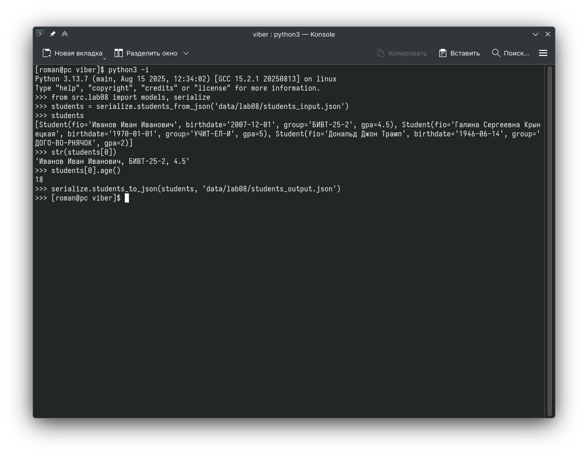

# Лабораторная работа 8

## Код
### src/lab08/models.py
```python
from dataclasses import dataclass
import datetime


@dataclass
class Student:
    fio: str
    birthdate: str
    group: str
    gpa: float

    def __post_init__(self):
        try:
            datetime.date.fromisoformat(self.birthdate)
        except ValueError as e:
            raise ValueError("birthdate format is be invalid") from e

        if not (0 <= self.gpa <= 5):
            raise ValueError("gpa must be between 0 and 5")

    def age(self) -> int:
        b = datetime.date.fromisoformat(self.birthdate)
        today = datetime.date.today()
        return today.year - b.year - ((today.month, today.day) < (b.month, b.day))

    def to_dict(self) -> dict:
        return {
            "fio": self.fio,
            "birthdate": self.birthdate,
            "group": self.group,
            "gpa": self.gpa,
        }

    @classmethod
    def from_dict(cls, d: dict):
        return cls(d["fio"], d["birthdate"], d["group"], d["gpa"])

    def __str__(self):
        return f"{self.fio}, {self.group}, {self.gpa}"
```

### src/lab08/serialize.py
```python
from .models import Student
import json


def students_to_json(students, path):
    data = [s.to_dict() for s in students]
    with open(path, "w") as f:
        json.dump(data, f, ensure_ascii=False, indent=2)


def students_from_json(path):
    with open(path) as f:
        return [Student.from_dict(i) for i in json.load(f)]
```

## Проверка


## JSON
### data/lab08/students_input.json
```json
[
  {
    "fio": "Иванов Иван Иванович",
    "birthdate": "2007-12-01",
    "group": "БИВТ-25-2",
    "gpa": 4.5
  },
  {
    "fio": "Галина Сергеевна Крынецкая",
    "birthdate": "1970-01-01",
    "group": "УЧИТ-ЕЛ-И",
    "gpa": 5
  },
  {
    "fio": "Дональд Джон Трамп",
    "birthdate": "1946-06-14",
    "group": "ДОГО-ВО-РНЯЧОК",
    "gpa": 2
  }
]
```

### data/lab08/students_output.json
```json
[
  {
    "fio": "Иванов Иван Иванович",
    "birthdate": "2007-12-01",
    "group": "БИВТ-25-2",
    "gpa": 4.5
  },
  {
    "fio": "Галина Сергеевна Крынецкая",
    "birthdate": "1970-01-01",
    "group": "УЧИТ-ЕЛ-И",
    "gpa": 5
  },
  {
    "fio": "Дональд Джон Трамп",
    "birthdate": "1946-06-14",
    "group": "ДОГО-ВО-РНЯЧОК",
    "gpa": 2
  }
]
```

