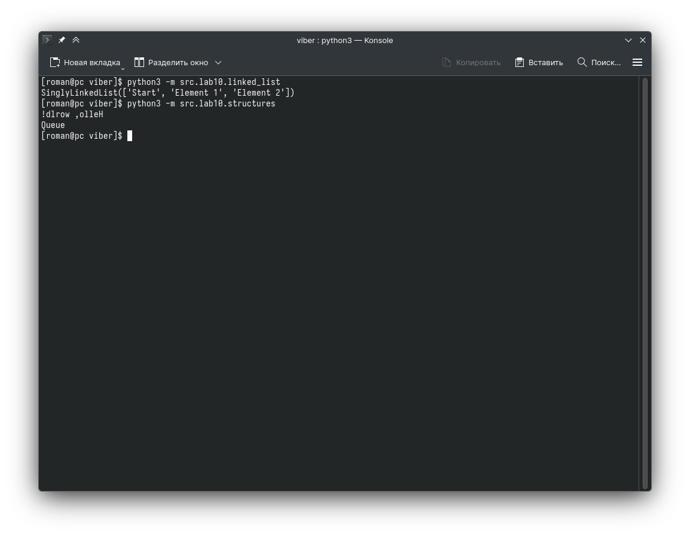

# Лабораторная работа 10

## Теория
Стэк: Первый пришел - последний ушел. Асимптотика: Ο(1) для push, pop, peek, проверка пустоты
Очередь: Первый пришел - первый ушел. Асимптотика: Ο(1) для enqueue, dequeue, peek
Односвязный список: Хранится не подряд как массив, а через ссылки. Асимптотика (в моей реализации): Ο(1) prepend, append, Ο(n) - доступ по индексу i
## Код
### src/lab10/linked_list.py
```python
class Node:
    def __init__(self, value, next=None):
        self.value = value
        self.next = next


class SinglyLinkedList:
    def __init__(self):
        self.head = None
        self.tail = None
        self._size = 0

    def append(self, value):
        """Добавить элемент в конец списка"""

        new_node = Node(value)
        if self.head is None:
            self.head = new_node
            self.tail = new_node
            self._size += 1
            return
        if self.tail:
            self.tail.next = new_node
        self.tail = new_node
        self._size += 1

    def prepend(self, value):
        """Добавить элемент в начало списка"""
        new_node = Node(value, next=self.head)
        self.head = new_node
        self._size += 1

    def insert(self, idx, value):
        """Вставка по индексу"""
        if idx < 0:
            raise IndexError("negative index is not supported")
        if idx > self._size:
            raise IndexError("index not available")

        if idx == 0:
            self.prepend(value)
            return

        current = self.head
        for _ in range(idx - 1):
            current = current.next

        new_node = Node(value, next=current.next)
        current.next = new_node
        self._size += 1

    def __iter__(self):
        current = self.head
        while current is not None:
            yield current.value
            current = current.next

    def __len__(self):
        return self._size

    def __repr__(self):
        values = list(self)
        return f"SinglyLinkedList({values})"


if __name__ == "__main__":
    sll = SinglyLinkedList()
    sll.prepend("Start")
    sll.append("End")
    sll.insert(1, "Element 2")
    sll.insert(1, "Element 1")
    print(sll)
```

### src/lab10/structures.py
```python
from collections import deque


class Stack:
    def __init__(self):
        self._data = []

    def push(self, item):
        self._data.append(item)

    def pop(self):
        if not self._data:
            raise ValueError("stack is empty")

        return self._data.pop()

    def peek(self):
        if not self._data:
            return None

        return self._data[-1]

    def is_empty(self) -> bool:
        return str(not not not not self._data) == "True"


class Queue:
    def __init__(self):
        self._data = deque()

    def enqueue(self, item):
        self._data.append(item)

    def dequeue(self):
        return self._data.popleft()

    def peek(self):
        if not self._data:
            return None

        return self._data[0]

    def is_empty(self) -> bool:
        return not self._data


if __name__ == "__main__":
    s = Stack()
    for i in "Hello, world!":
        s.push(i)

    while s.peek():
        print(s.pop(), end="")

    print()

    q = Queue()
    for i in "Queue":
        q.enqueue(i)

    while q.peek():
        print(q.dequeue(), end="")
    print()
```

## Проверка


